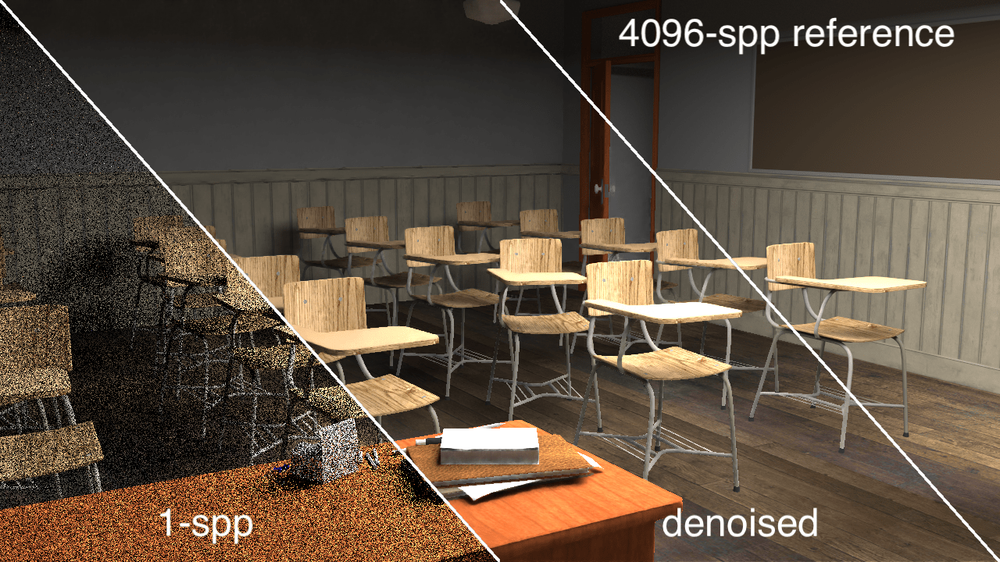
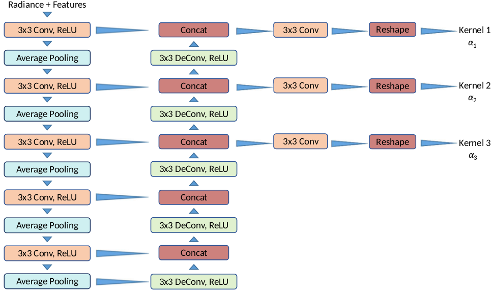
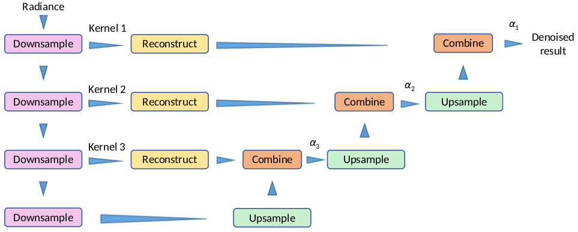

# MultiResolutionKernelPredictionCNN
A Multi-Resolution variant of Kernel Prediction CNN (MR-KP) denoiser

We have adapted the Multi-Resolution [Kernel Prediction CNN (MR-KP) denoiser](https://dl.acm.org/doi/10.1145/3072959.3073708), which decreases the run time of a basic kernel prediction architecture to the order of tens of milliseconds (35ms on a Nvidia RTX 2080 GPU).


### The structure of the network



### The structure of the pyramid-denoiser:



### Citation
If you find this implementation useful in your research, please consider citing:
```
@article{10.1145/3072959.3073708, 
  author = {Bako, Steve and Vogels, Thijs and Mcwilliams, Brian and Meyer, Mark and Nov\'{a}K, Jan and Harvill, Alex and Sen, Pradeep and Derose, Tony and Rousselle, Fabrice}, 
  title = {Kernel-Predicting Convolutional Networks for Denoising Monte Carlo Renderings}, 
  year = {2017}, 
  issue_date = {July 2017}, 
  publisher = {Association for Computing Machinery}, 
  address = {New York, NY, USA}, 
  volume = {36}, 
  number = {4}, 
  issn = {0730-0301}, 
  url = {https://doi.org/10.1145/3072959.3073708}, 
  doi = {10.1145/3072959.3073708}, 
  journal = {ACM Trans. Graph.}, 
  month = jul, 
  articleno = {97}, 
  numpages = {14}, 
  keywords = {global illumination, Monte Carlo denoising, Monte Carlo rendering} 
}
@inproceedings {Meng2020Real, 
  booktitle = {Eurographics Symposium on Rendering 2020}, 
  title = {{Real-time Monte Carlo Denoising with the Neural Bilateral Grid}}, 
  author = {Xiaoxu Meng, Quan Zheng, Amitabh Varshney, Gurprit Singh, Matthias Zwicker}, 
  year = {2020}, 
  publisher = {The Eurographics Association}, 
}
```
